# Clusterização de dados

## Estruturando um programa de fidelidade para um e-commerce

No final de 2009, a Netflix lançou um concurso para aprimorar o mecanismo de recomendação dela. O Netflix Prize, que teve como objetivo encontrar um novo algoritmo para melhorar a precisão das previsões sobre o quanto alguém gostará de um filme com base nas preferências que tem. O prêmio seria nada menos que 1 milhão de dólares para os vencedores.

Por que esse tipo de algoritmo é tão valioso? Dados não rotulados são abundantes em quase todas as aplicações, no entanto são difíceis de se interpretar.

Exatamente por esse motivo, algoritmos que aprendem a partir de dados não rotulados são extremamente valiosos, e as empresas mantém esses algoritmos e esses sistemas sob grande sigilo.

Nesta unidade de estudo aprofundaremo-nos nessa área tão importante do aprendizado de máquina: a clusterização de dados. Logo, o que desejamos é responder à seguinte pergunta:

Como usar dados não rotulados para aprender sobre uma situação e identificar padrões que possam nos ajudar a resolver problemas complexos?

No primeiro desafio, auxiliaremos uma empresa a segmentar os clientes do e-commerce dela para criar uma estratégia de marketing personalizada e um programa de fidelidade. Essa empresa tem uma base de dados de todas as compras realizadas pelos clientes e gostaria de entender como pode estabelecer uma política de descontos e promoções, definindo quem são os consumidores que merecem participar.
Atenção

Para fazer essa prática, utilizaremos a base de dados Online Retail Dataset, disponível no Kaggle. Para baixar os dados basta acessar o link https://www.kaggle.com/lakshmi25npathi/online-retail-dataset e realizar o download.

### Algoritmos de clusterização

A clusterização é a tarefa de dividir a população em vários grupos, de modo que as amostras nos mesmos grupos sejam mais semelhantes entre si do que com as de outros grupos. Existem diferentes tipos de abordagem e métodos para a realização dessa tarefa. Peres e Lima (2015) nos ajudam a entendê-los, a partir da sistematização clicando nas sanfonas a seguir.

#### Método por particionamento

Os métodos pertencentes a esse tipo procuram construir um número k partições dos dados, em função de um conjunto de dados com n amostras. Esse número k é arbitrário, ou seja, definido pela equipe de projeto, e pode ser investigado durante a construção do sistema.  

#### Métodos hierárquicos

Os métodos hierárquicos organizam um conjunto de dados em uma estrutura hierárquica, de acordo com a proximidade entre os indivíduos (CASSIANO, 2014). Essa estrutura hierárquica é representada em uma árvore binária ou um dendrograma. Quanto mais similares, mais próximas as amostras são representadas nessa árvore.

#### Métodos baseados em densidade

Nos métodos baseados em densidade, os clusters são interpretados como regiões densamente populadas por amostras separadas de outros clusters por regiões menos densas. Assim, esses algoritmos se traduzem na busca por regiões mais densas de amostras. 

#### Métodos baseados em modelos

Métodos baseados em modelos criam hipóteses sobre como cada um dos grupos se apresenta e encontra o melhor ajuste dos dados ao modelo. Esses modelos costumam utilizar outros métodos de aprendizado de máquina para inferir a distribuição das amostras.

#### Métodos baseados em grafos

Métodos baseados em grafos interpretam as amostras como um grafo, em que os k pontos mais próximos de uma certa amostra formam arestas com ela. Amostras mais próximas geram grafos de alta conectividade, que indicam os clusters. Já amostras mais distantes geram grafos de baixa conectividade, o que indica as fronteiras dos agrupamentos.

Além dos enumerados por Peres e Lima (2015), existem diversos outros tipos de abordagem e métodos disponíveis na literatura: métodos baseados em otimização, em topologia, em modelos fuzzy etc.

Não há garantias de que um determinado critério funcione bem para todos os problemas. Por isso, precisamos conhecer bem os índices. 

### K-means (ou K-médias)

É a técnica de clusterização mais simples. Trata-se de um método baseado em particionamento, que consiste em fixar um número k de grupos (clusters) que representam os rótulos determinados e, para cada um deles, um ponto central (chamado de centroide) dentro do espaço de características. Após a fixação dos k-centroides, o algoritmo mede a dissimilaridade de cada amostra aos centroides e rotula cada amostra ao centroide mais próximo.

No entanto, como os centroides e as posições deles são escolhidos de forma arbitrária, não há garantias que os clusters formados sejam coesos. Para garantir uma maior coesão, o algoritmo recalcula a posição dos centroides, com base nos indivíduos agrupados, e repete todo o processo novamente.

Dessa forma, o algoritmo não finaliza quando todas as amostras estão rotuladas, mas, sim, quando a posição dos centroides não se altera entre uma iteração e outra. A animação a seguir mostra exatamente esse processo.

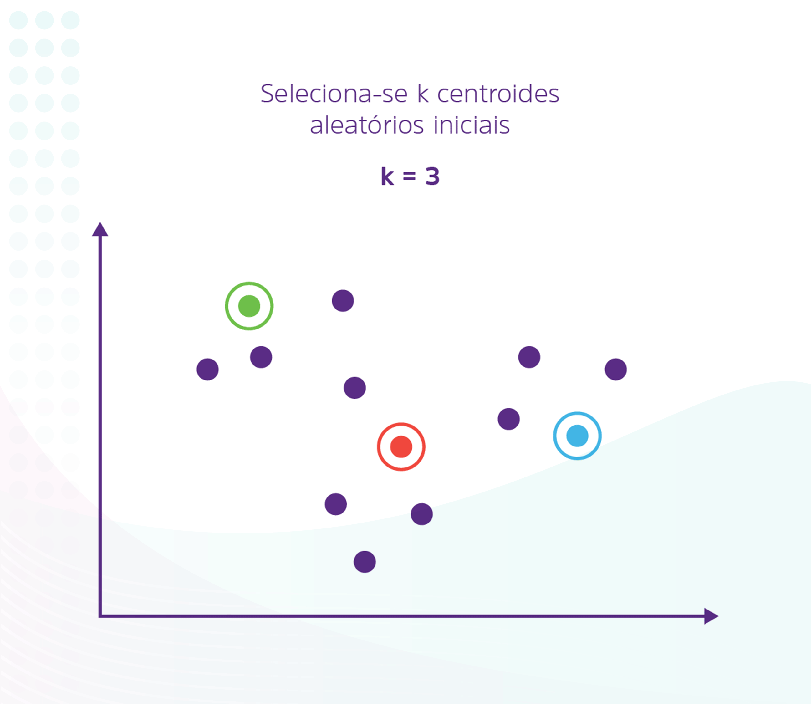

Mesmo sendo interativo, o algoritmo ainda é dependente da quantidade de clusters e da posição inicial deles. Por esse motivo, algumas estratégias devem ser consideradas para responder duas perguntas:Como saber a melhor posição para os centroides? Como saber se o número de clusters é o ideal?

Para aprofundar um pouco mais o conhecimento obtido até aqui, a partir de nossas discussões sobre o conteúdo, assista ao vídeo a seguir, que apresenta importantes considerações sobre a temática da unidade.

#### Propagação de Afinidades

O K-means apresenta uma limitação muito clara: ou se pressupõe uma quantidade de clusters, ou se busca uma quantidade ideal mudando arbitrariamente a quantidade de centroides. Imagine, então, se houvesse um algoritmo que encontrasse o número ótimo de clusters para o problema? É exatamente o que o algoritmo Affinity Propagation (Propagação de Afinidades) faz. A seguir, maiores detalhes a respeito.

A Propagação de Afinidades (AP) é um algoritmo, baseado em grafos, que entende cada amostra da base de dados como um nó em uma rede. 

Para identificar os agrupamentos, ele promove uma troca de mensagens entre todos os nós com o objetivo de identificar aqueles que representam melhor como os dados estão agrupados. 

Os nós mais representativos, chamados de exemplares, são os candidatos a se tornarem centroides de cada cluster.

Mas o que são essas mensagens e esses exemplares? Vamos por partes.

As mensagens trocadas entre pares são métricas que representam a adequação de uma amostra para ser o exemplar de outra. Essa métrica é atualizada iterativamente à medida que mensagens são trocadas entre diferentes pares de amostras. 

Definição dos exemplares

Na busca pelas amostras exemplares, o algoritmo utiliza quatro conceitos, traduzidos em matrizes: similaridade, responsabilidade, disponibilidade e valor de critério. Assim, a cada iteração, o algoritmo faz os seguintes cálculos:

Matriz de similaridade

Essa matriz apresenta uma medida de similaridade entre todas as amostras. Cada célula dessa matriz, tem um valor que corresponde ao grau de similaridade entre duas amostras.

Matriz de responsabilidade

A responsabilidade é entendida como a relação entre a similaridade de duas amostras, calculada na matriz de similaridade, e a máxima similaridade dessas amostras com todas as outras. Na prática, se quisermos saber qual a responsabilidade de uma amostra A sobre uma amostra B, resgatamos a similaridade entre A e B na matriz de similaridade e subtraímos dela a maior similaridade de B com todas as outras amostras. 

Matriz de disponibilidade

Essa matriz determina um índice de chance de que cada amostra seja um centroide de um cluster. Ela é calculada realizando-se o somatório das responsabilidades positivas de cada amostra. Quando maior esse somatório, maior a chance de que essa amostra seja um centroide. 

Matriz de critério

Essa matriz é obtida somando-se a matriz de responsabilidade com a matriz de disponibilidade. O valor resultante de cada célula é chamado de valor de critério. O maior valor de critério de cada linha é selecionado, e o número de exemplares é o número de clusters finais do problema.

Cada iteração do algoritmo consiste em atualizar todas as responsabilidades a partir das disponibilidades e combinando disponibilidades e responsabilidades para monitorar as decisões exemplares. Essa atualização acontece iterativamente até que haja uma convergência, ou seja, o momento em que os exemplares de cada amostra não se alteram entre uma iteração e outra. A animação a seguir mostra as modificações dos rótulos das amostras entre as iterações.

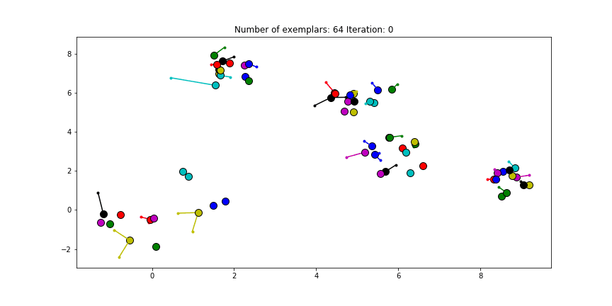

Perceba, na animação, que, na interação 1, cada amostra, por mais próxima que pareça, tem um rótulo diferente. Conforme novas iterações foram realizadas, as mensagens trocadas iniciaram um processo de convergência, no qual os exemplares são definidos, enquanto as amostras próximas assumem, sistematicamente, os rótulos deles. Esse processo é repetido até que todos os rótulos convirjam.

Clustering Hierárquico

Algoritmos de Clusterização Hierárquica (HC) organizam o conjunto de amostras em uma estrutura hierárquica, uma árvore, de acordo com a similaridade entre as amostras. Quanto mais similares duas amostras são, mais próximas elas estão dentro dessa estrutura. Os algoritmos de agrupamento hierárquico se enquadram em duas categorias: divisivos ou aglomerativos.

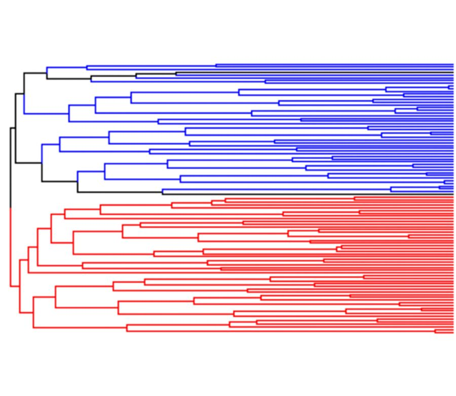

Dendogramas

Os resultados de um algoritmo HC são mostrados na forma de um dendograma (uma árvore que subdivide a base de dados em subconjuntos menores). A raiz do dendograma (parte superior do gráfico) representa a agrupamento de todas as amostras, e os nós folhas (parte inferior do gráfico) representam cada uma das amostras. O resultado da clusterização pode ser obtido cortando-se o dendograma em diferentes níveis, de acordo com o número de cluster k desejado. A animação "Clustering Hierárquico aglomerativos", a seguir, mostra a construção aglomerativa de um dendograma.

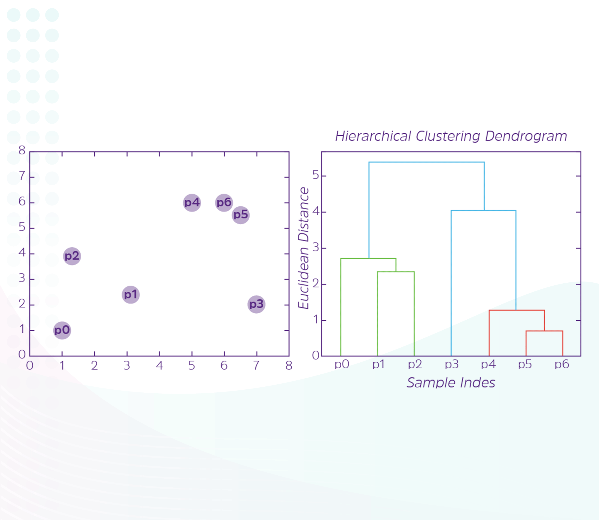

Perceba, na animação, que o dendograma não representa somente a ordem em que as amostras são clusterizadas. O eixo vertical identifica o valor da métrica de similaridade entre as amostras e entre uma amostra e outros clusters. Assim, quanto mais "alta" a junção, mais distante estão as amostras entre si. 

Modelos de conexão para Clustering Hierárquicok

Sempre que falamos sobre a ideia de distância entre clusters, até o momento, recorremos à ideia da distância de uma amostra a um centroide. Contudo, no Clustering Hierárquico, temos a alternativa de determinar a distância entre os clusters a partir das amostras de cada cluster. Isso significa que podem existir diferentes formas de determinar esse valor. Há três maneiras diferentes de medir a distância entre dois clusters, que são descritas na sequência.

Single Link

A distância entre dois clusters é dada pela distância entre os pontos mais próximos dele, também chamada de “agrupamento de vizinhos” (neighbour clustering). É um método guloso, que prioriza elementos mais próximos, deixando os mais distantes em segundo plano.

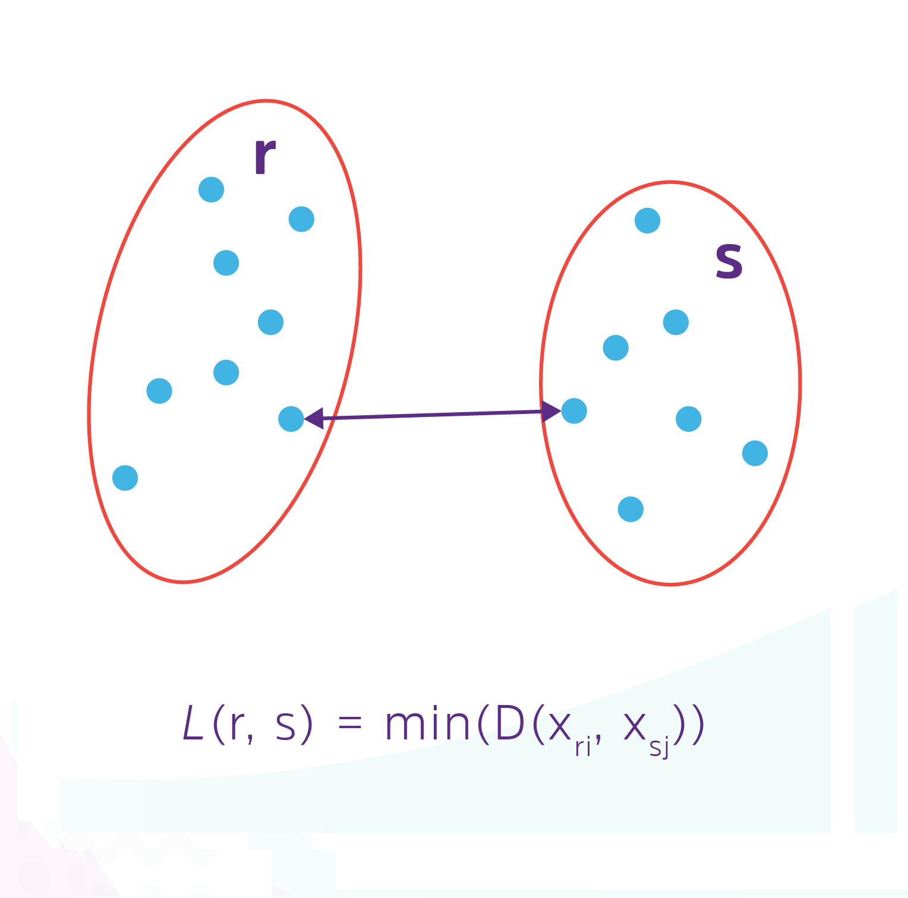

Average Link

A distância é dada pela distância entre os centroides. Por isso, é chamada de distância média entre os clusters. O problema dessa abordagem é a necessidade de se recalcular.

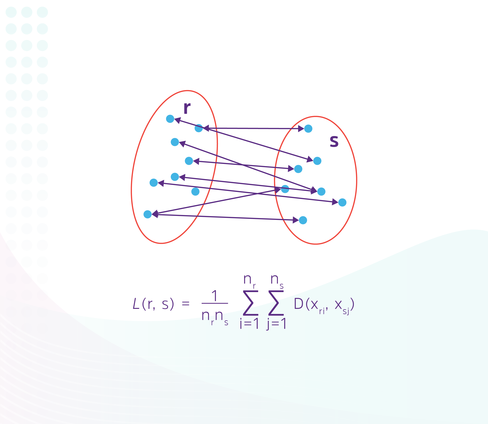

Complete Link

A distância entre clusters é dada pela distância entre os pontos mais distantes deles.

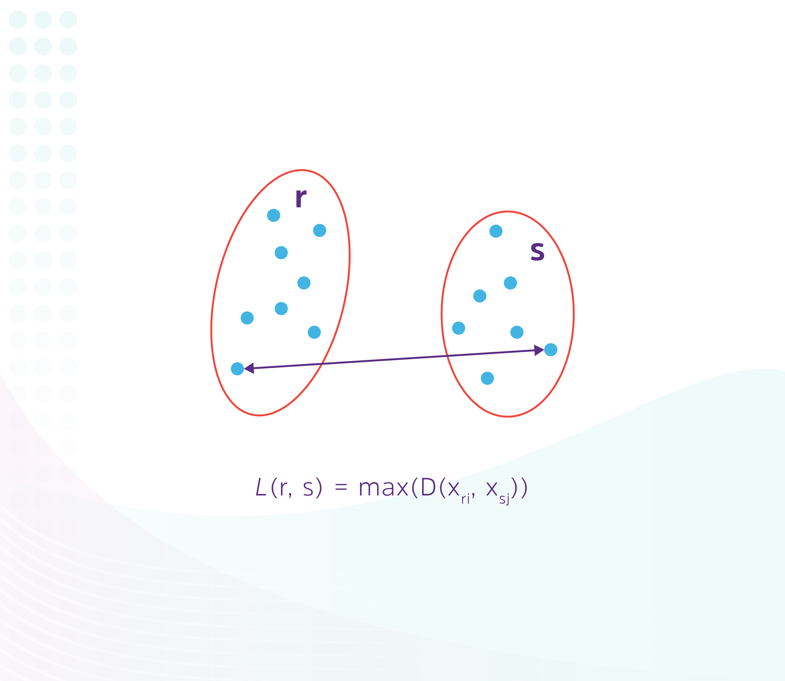

Algoritmos de clusterização na prática

A utilização no Sklearn destes algoritmos é bastante simples. Basta instanciar os modelos, treiná-los utizando a função fit e realizar previsões utilizando a função predict. Como exemplo, podemos ver a seguir como utilizar o Affinity Propagation.

Cada modelo possui uma parametrização diferente. Um detalhe importante é que a implementação desse algoritmo depende da parametrização dele. No Affinity propagation, o principal parâmetro é o damping. Já no DBSCAN dois principais parâmetros são o eps e o min_samples: o parâmetro eps (Epsilon) é a distância máxima entre duas amostras para que uma seja considerada próxima da outra (raio de alcance); e o min_samples é o número de amostras (ou peso total) em uma vizinhança para um ponto a ser considerado como um ponto central. Isso inclui o próprio ponto. 

Assim como os demais algoritmos, a utilização da clusterização hierárquica no Sklearn é bastante simples. Basta utilizar o modelo AgglomerativeClustering presente na biblioteca. Existe também uma versão bastante utilzada em uma bibloteca chamada SciPy que implementa o clustering hierárquico.

Existem três parâmetros importantes para o Clustering Hierárquico: a métrica de similaridade (affinity), o modelo de conexão (linkage) e a quantidade de clusters desejados (n_clusters). A mudança desses parâmetros provoca mudanças profundas no agrupamento. Sempre teste as alternativas possíveis ao problema.

Agora que entendemos a forma de utilização dos algoritmos, podemos retornar ao nosso exemplo e ver a aplicação de dois desses algoritmos sobre a base de dados Online Retail.

[Prática de Clusterização - Online Retail](./extra-content/fb25ccb3a487cf09a205b4e9ce57c1f2(2).pdf)

#### Sistemas de Recomendação

Esse processo de personalização transcende a simples ideia de que os produtos são os únicos itens a serem personalizados para cada usuário, pois há mudanças na interface gráfica, na apresentação dos itens e, até mesmo, no comportamento dos produtos.

O uso de dados não rotulados é, sem dúvida, um grande ativo para as empresas.

"A ideia básica dos sistemas de recomendação é utilizar várias fontes de dados para inferir os interesses dos clientes" (AGGARWAL, 2016, p. 1, tradução nossa).

Um sistema de recomendação, portanto, é um sistema de aprendizado que utiliza os dados disponíveis sobre a história de interações e informações sobre os usuários e itens para gerar uma lista compilada de itens nos quais um usuário pode estar interessado.
Exemplo

Por exemplo, o sistema de recomendação de filmes como o da Netflix oferece recomendações combinando e pesquisando hábitos semelhantes de usuários e sugerindo filmes que compartilham características com filmes que os usuários classificaram bem.

O propósito desse sistema, nesse sentido, é gerar engajamento, expandindo as sugestões de itens aos usuários sem qualquer perturbação ou monotonia. 

Recomendações baseadas em filtros colaborativos

Os algoritmos baseados em filtros colaborativos assumem como premissa que usuários semelhantes exibem padrões semelhantes de comportamento de interação e avaliação e que itens semelhantes recebem avaliações semelhantes. Aggarwal (2016, p. 9, tradução nossa) estabelece que "Modelos de filtragem colaborativa usam o poder colaborativo das classificações fornecidas por vários usuários para que façam recomendações".

Existem duas formas de se estabelecer esse poder de colaboração: centradas nas similaridades entre usuários ou centradas nas similaridades entre itens. Para entender essa diferença, precisamos compreender o elemento fundamental dessa abordagem: a Matriz de Interação Usuário-Item.

A Matriz de Interação Usuário-Item (Matrix of User-Items Interactions) é uma representação matricial de todas as interações entre usuários e os itens, em que cada linha representa um usuário, cada coluna representa um item, e os valores das células representam a interação (que pode ser a avaliação, a visualização, os likes etc.). A figura a seguir mostra um exemplo de uma matriz como essa.

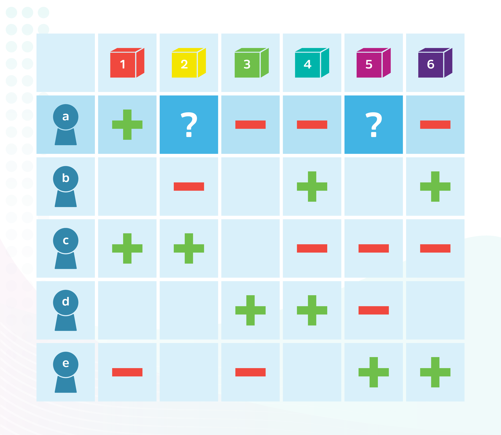

Dessa forma, conforme podemos ver na figura anterior, para um usuário "a", não houve interação com os itens 2 e 5. Nesse caso, o que um recomendado faz é prever esses elementos ausentes e decidir qual item tem mais probabilidade de ser preferido pelo usuário. Nesse ponto, cada uma das abordagens propõe diferentes estratégias.

Os filtros colaborativos de usuários buscam a similaridade nas interações entre usuários (entre as linhas) para determinar a predição. No exemplo da figura "Matriz de Interação Usuário-Item", esse filtro buscaria o usuário mais similar ao usuário "a" para realizar a previsão.  

Os filtros colaborativos de itens buscam a similaridade nas interações entre itens (entre as colunas) para determinar a predição. No exemplo da figura "Matriz de Interação Usuário-Item", esse filtro buscaria o item mais similar ao item 2 e 5 para realizar a previsão. 

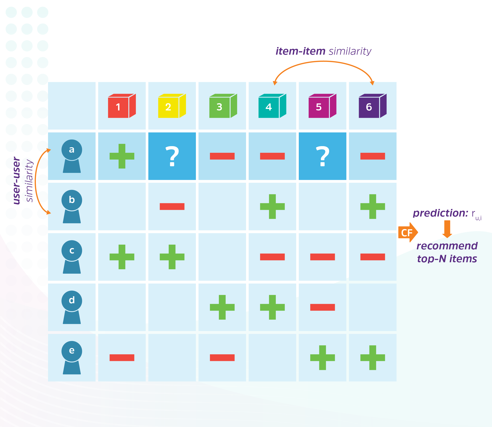

É fácil perceber que métodos baseados em similaridade utilizam o conceito de vizinhança. Sarwar et al. (2016) mostram que esses sistemas utilizam técnicas estatísticas para encontrar um grupo de usuários, os vizinhos, que concordam com as avaliações sobre os itens. Assim, podemos entender que a predição desses algoritmos pode ser realizada por meio do método k-NN e das métricas utilizadas por ele.

Várias plataformas utilizam filtros colaborativos para realizar recomendações. Um muito conhecido é o Spotfy. Clark Boid descreve muito bem como esse mecanismo é utilizado nesse aplicativo.

[spotify recommendations](https://towardsdatascience.com/finding-your-next-beloved-artists-37596d48f32c/)

Recomendações baseadas em conteúdo

Os sistemas de filtragem colaborativa discutidos no tópico anterior usam as correlações nos padrões de classificação entre os usuários para fazer recomendações. Por outro lado, esses métodos não usam atributos dos itens para gerar previsões. Os sistemas baseados em conteúdo (Content-based) partem da premissa de que se recomende itens semelhantes com base nas características de um item específico. A ideia geral por trás desses sistemas de recomendação é que, se uma pessoa gosta de um item específico, ela também gostará de outro semelhante a ele. 

A figura "A diferença entre os sistemas baseados em conteúdos dos sistemas baseados em filtragem" mostra a diferença entre essa abordagem e a abordagem por filtragem: se, nos sistemas baseados em filtragem avalia-se a similaridade com base nas interações de vários usuários com o conteúdo (filmes), nos sistemas baseados em conteúdo, utilizam-se as informações de similaridade entre os conteúdos e o histórico de interações de um usuário para a geração das recomendações. 

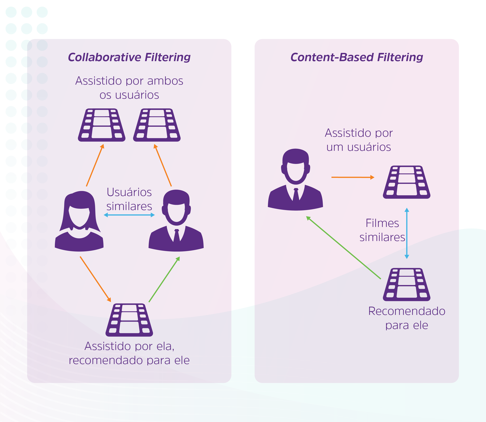

Esses sistemas usam metadados de itens para gerar recomendações. Em uma plataforma de streaming de filmes e séries, por exemplo, utilizaria informações como gênero, diretor, descrição, atores, para fazer essas recomendações. O YouTube, por exemplo, utiliza o histórico de visualizações de um usuário para sugerir novos vídeos.

Recomendações baseadas em conhecimento

Os sistemas baseados em conteúdo e os colaborativos compartilham uma característica em comum: demandam uma quantidade significativa de dados sobre as interações anteriores e experiências de avaliação. O que fazer se a quantidade de dados é limitada ou rara?

Em casos em que a quantidade de dados disponíveis é limitada, essas duas abordagens geram recomendações insatisfatórias. Esse problema é chamado de "problema da inicialização a frio", já tratado anteriormente. Os sistemas colaborativos são os mais suscetíveis a esse problema e não lidam bem com novos itens ou novos usuários.

Já os sistemas de recomendação baseados em conteúdo são um pouco melhores em lidar com novos itens, mas eles ainda não podem fornecer recomendações para novos usuários. Aggarwal (2016) enumera que estes sistemas são utilizados quando: usuários desejam especificar explicitamente os requisitos deles, por exemplo, na compra de automóveis e imóveis. Quanto mais características forem definidas pelos usuários, mais assertivas serão as recomendações; quando é difícil obter recomendações para um tipo específico de item, devido a maior complexidade do domínio do item; ou quando há evolução temporal dos itens. Em alguns domínios, como computadores, as recomendações podem ser sensíveis ao tempo. Os itens evoluem com a mudança da disponibilidade do produto e requisitos do usuário correspondentes. 

Nos sistemas baseados em conhecimento, utiliza-se as informações de usuários, os atributos e as metainformações dos itens e uma base de conhecimento sobre o problema. Essa base de conhecimento pode ser expressa na forma de um modelo de aprendizado gerado especificamente para o sistema ou, até mesmo, um conjunto de regras e restrições que precisam ser aplicadas ou ponderadas durante a recomendação. A figura "Sistemas de recomendação baseados em conhecimento" a seguir ilustra essa estrutura.

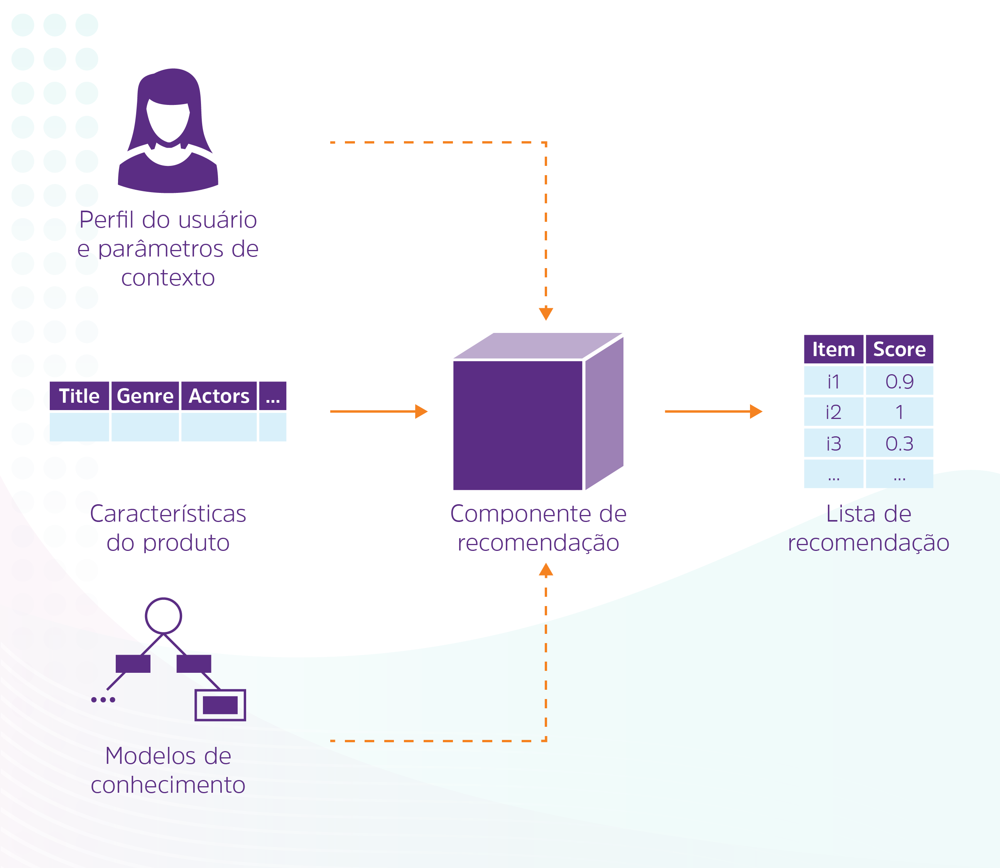

Sistemas de recomendação na prática: construindo um sistema de recomendação de filmes

Agora que já entendemos bem como os sistemas de recomendação funcionam, está na hora de aplicarmos ao nosso problema. Estudaremos o caso de uma empresa que tem uma plataforma de streaming de conteúdo e deseja aumentar o engajamento dos usuários nos conteúdos que ela fornece, a partir de um sistema de recomendação. Para isso, ela recuperou todas as informações de avaliação dos usuários e pretende utiliza-la para prever qual a avaliação que um usuário daria a um item. O Tutorial abaixo mostra como criar seu sistema de recomendação utilizando a biblioteca Surprise do Python.

[Sistema de recomendação utilizando a biblioteca Surprise sobre a base de dados MovieLens. ](./extra-content/3b3928ce6047176ce97ec50c023bcefa(2).pdf)

