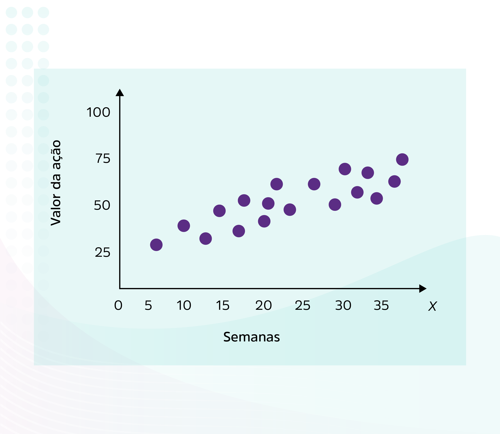
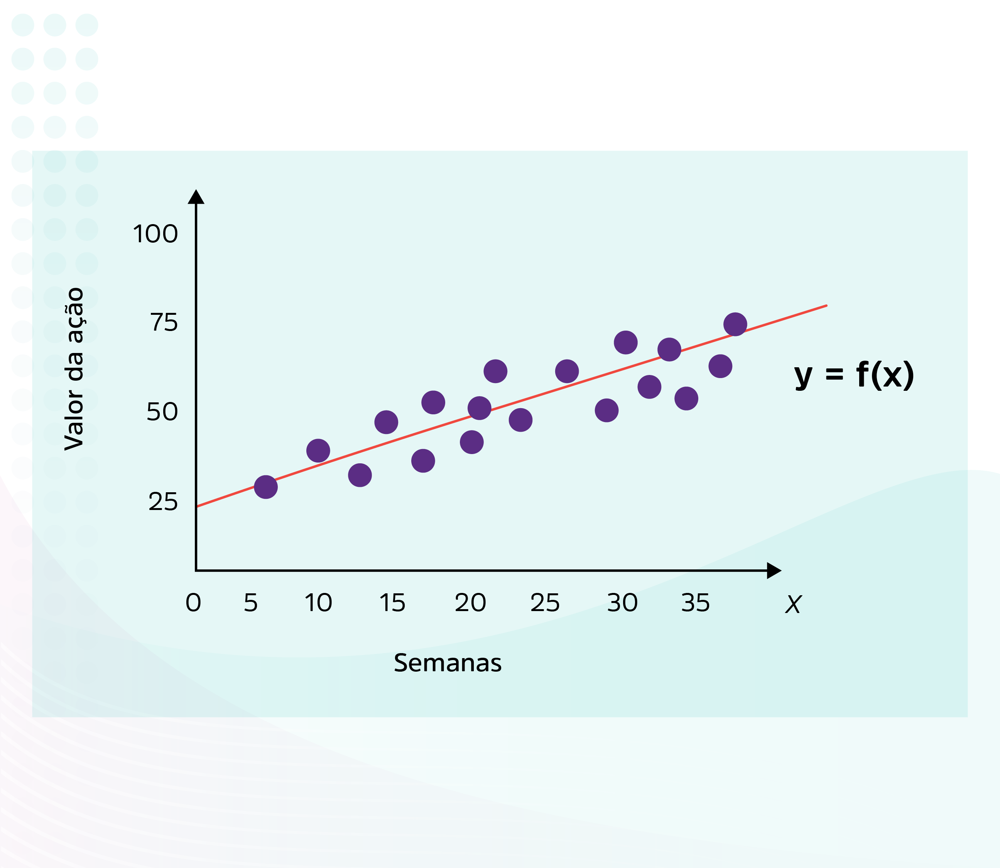
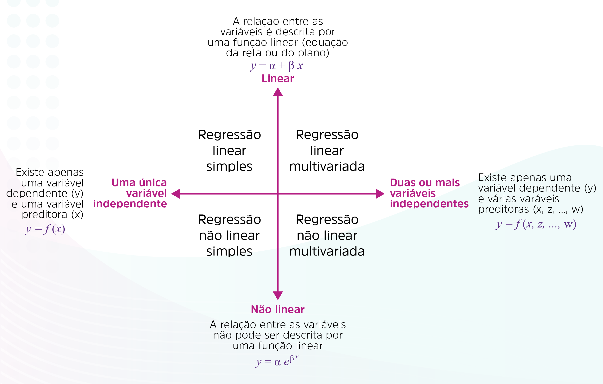
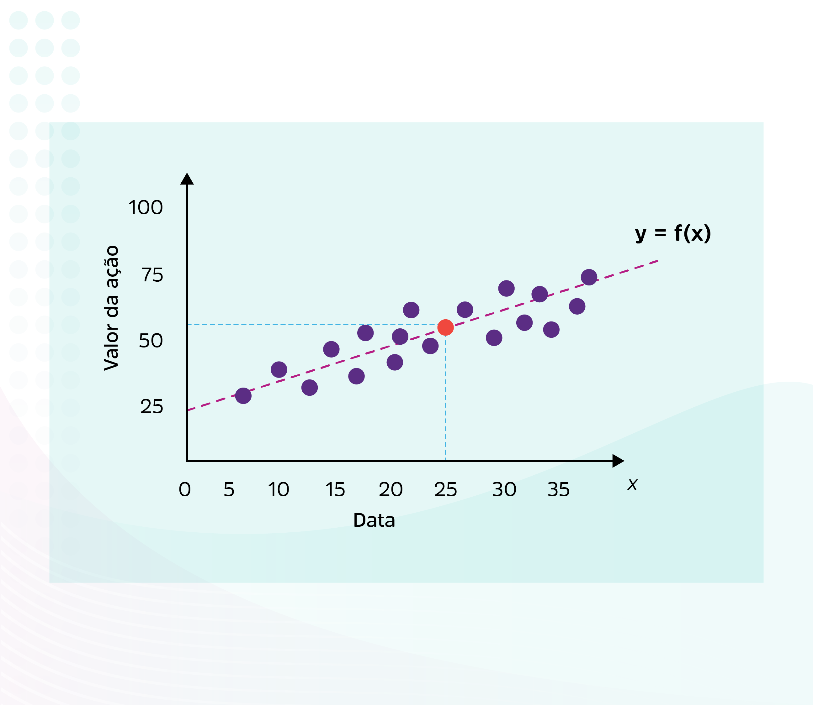
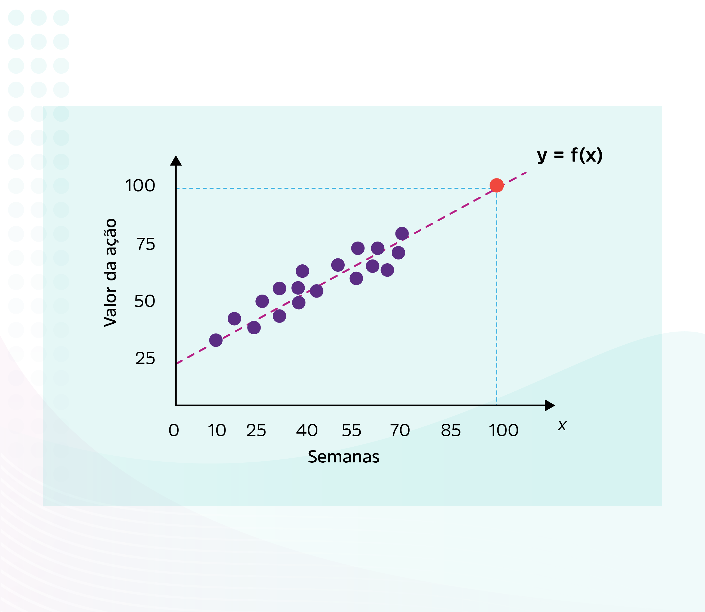
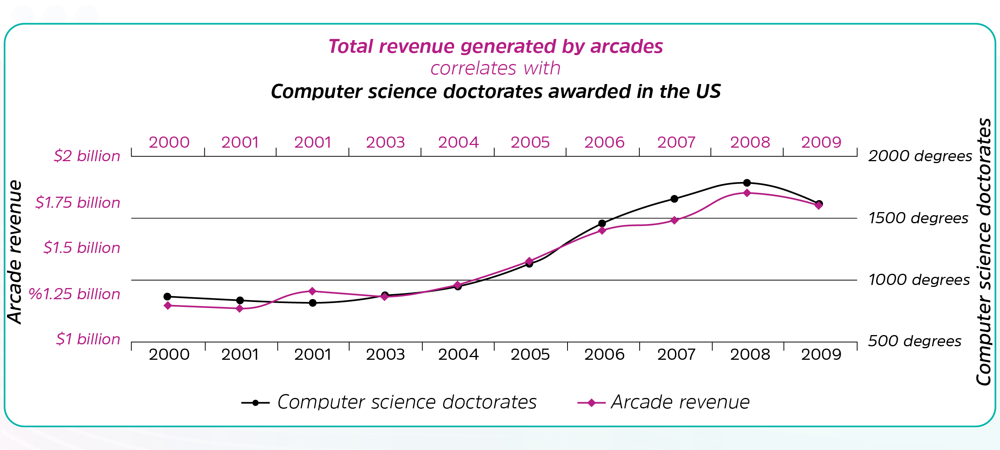
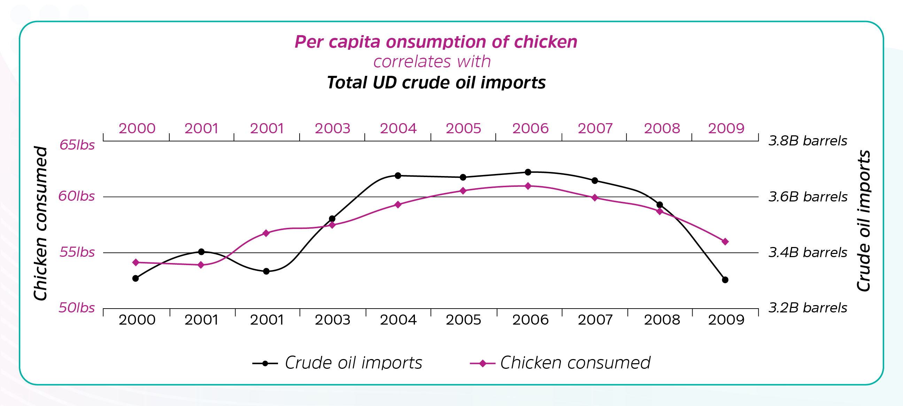

# Regressão e séries temporais

Como fio condutor para a nossa trajetória de estudos, construiremos, juntos, um algoritmo que utiliza a Análise de Regressão para uma aplicação no mercado financeiro. Tentaremos prever o valor de uma ação na bolsa de valores.

Um fundo de investimento deseja acompanhar o valor da sua carteira de ações na bolsa para otimizar seus investimentos, com a finalidade de melhorar a margem de lucro. Para que os investimentos sejam realizados, mais que ter visão sobre o passado, é necessário compreender as tendências de variação do preço das ações e prever um cenário futuro que permita auxiliar a estratégia de compra e venda.

Para isso, esse fundo dispõe de uma base de dados com o valor de cada ação ao longo dos últimos anos. Nossa missão será utilizar essa base de dados para criar um cenário de futuro e avaliar quão bem nosso algoritmo consegue prever o que vai acontecer com o valor de uma ação. 

## Análise de Regressão

Seria possível prever a altura de uma pessoa adulta com base na altura dos seus pais? E prever o consumo de um veículo com base na potência do motor e no tamanho dos pneus? É fácil presumir que haja, sim, uma relação entre as variáveis e que isso se traduza em uma tendência. É fácil supor que a altura dos filhos será próxima a dos pais ou que, quanto mais potente um veículo, maior será o seu consumo.

No entanto, quando tentamos quantificar essa relação para realizar previsões, a tarefa se torna bem mais complicada. Por exemplo: qual o consumo de um veículo com um motor de 150 cavalos de potência e pneus aro 16? É exatamente para esse tipo de tarefa que utilizamos as técnicas de Análise de Regressão.

O termo "regressão" foi empregado, pela primeira vez, pelo antropólogo Sir Francis Galton (que, por curiosidade, era primo de Charles Darwin) em 1885, num estudo em que demonstrou que a altura dos filhos não tende a refletir a altura dos pais, mas a média da população. 

Assim, o que chamamos de Análise de Regressão é o conjunto de técnicas voltadas para a modelagem e para a investigação da correlação entre duas ou mais variáveis. 

Podemos, então, definir que o objetivo da Análise de Regressão é Construir um modelo matemático que expresse a correlação entre as variáveis e seja capaz de predizer valores de uma variável Y (chamada variável dependente) com base nos valores de outra variável X (chamada preditora ou independente).

Neste ponto, já entendemos que o objeto de investigação da Análise de Regressão é a correlação. Agora, podemos definir a correlação como uma medida que indica a força e a direção do relacionamento entre duas variáveis. Ao analisar a correlação, é possível verificar e ajustar um modelo matemático que expresse a relação. 

Vamos estabelecer um exemplo simples: imagine se recuperássemos o valor de fechamento de uma ação da bolsa durante 35 semanas. Se plotarmos esses valores sobre um gráfico de dispersão, teríamos, como resultado, a Figura a seguir, Valores de uma ação durante um período de 35 semanas.

É fácil perceber que, durante esse período, há uma tendência de valorização da ação. O objetivo da Análise de Regressão não é só observar essa tendência, mas identificar essa relação e encontrar uma função matemática $y=f(x)$, na qual, dado um valor para x (semana), seja possível prever o valor de y (valor da ação). Traçando uma linha utilizando essa função sobre os dados, poderíamos ver o quão bem a sua forma representa a tendência de variação (explica os dados). A próxima Figura, Função matemática que representa a correlação entre tempo e valor da ação, mostra uma função linear que poderia representar essa relação.

Assim, o objetivo é identificar a linha que melhor representa a dispersão dos dados. Na Figura acima, Função matemática que representa a correlação entre tempo e valor da ação, essa linha é representada por uma função linear. Contudo, uma linha reta é apenas um caso possível. Vamos nos aprofundar um pouco nas possibilidades da Análise de Regressão.

### Linearidade, não lineariedade e regressão multivariada

O exemplo anterior assume algumas premissas sobre as quais podemos operar. A primeira é que a função é expressa sempre por uma função linear. Se a correlação é expressa por uma função linear, então, é uma regressão linear. Se a correlação é expressa por uma função não linear (polinominiais, exponenciais e logarítmicas), dizemos que é uma regressão não linear.

- Modelo linear: $f(x)= \alpha + \beta.x$

- Modelo não linear: $f(x)= e^{\alpha + \beta x}$

A segunda premissa é que existe apenas uma variável preditora (x) para a variável dependente (y). Se isso é verdadeiro, dizemos que estamos realizando uma regressão simples. Caso exista mais de uma variável preditora (por exemplo, potência do motor e tamanho do pneu) para uma variável dependente (y), então, se trata de uma regressão multivariada.

- Regressão simples: $f(x)= \alpha + \beta.x$

- Regressão multivariada: $f(x_1, x_2, x_3)= \alpha + \beta_1.x_1 + \beta_2.x_2 + \beta_3.x_3$

No caso da regressão multivariada, a função passa a contar com um conjunto de parâmetros independentes ($\beta_1, \beta_2, \beta_3$) para cada variável preditora ($ x_1, x_2, x_3 $) combinada linearmente. Assim, o desafio é encontrar um valor para cada parâmetro na busca do ajuste da função dos dados. Além disso, a regressão multivariada não gera uma linha que explica os dados, mas uma superfície no hiperplano chamada de superfície de regressão ou superfície de resposta.

Pela combinação desses tipos, é possível realizar uma regressão não linear simples ou uma regressão linear multivariada, por exemplo. A Figura a seguir, Resumo dos tipos de análise de regressão, mostra um resumo dessas diferenças e suas combinações.

Em 2018, Anna Carolina Silva Santos e Rafael Lucas Machado Pinto, pesquisadores da Universidade Federal de Ouro Preto (MG), realizaram um estudo para identificar o tipo de relação existente entre oferta de etanol e alguns fatores socioeconômicos do setor, bem como para analisar a relação entre as variáveis selecionadas. Para isso, eles se basearam na análise de correlação e utilizaram dados estatísticos anuais do setor durante o período de 2006 a 2015.

[Aplicação da Análise de Correlação e Regressão Linear Simples no Setor Sucroenergético Brasileiro](./extra-content/75ea0c01ac6f0c427ad33cd31326557a.pdf)

Trabalho de David Brandão Nunes,
José de Paula Barros Neto e Silvia Maria de Freitas sobre como eles utilizaram a análise de regressão multivariada e como essa técnica é aplicada no mercado imobiliário.

[Modelo de regressão linear múltipla para avaliação do valor de mercado de apartamentos residenciais em Fortaleza, CE](./extra-content/4d360508087596524258dcb68c256729.pdf)

### Interpolação vs. extrapolação

O modelo gerado permite realizar previsões sobre os dados de forma a inferir eventos que ainda não aconteceram a partir da tendência apresentada. Podemos prever eventos que estejam dentro ou fora do nosso espaço amostral. Essa diferença identifica o propósito da análise, dando origem aos termos "interpolação" e "extrapolação".

Interpolação

Quando queremos prever o valor de y para um dado valor de x dentro do intervalo dos dados disponíveis. Chamamos isso de interpolação.

Extrapolação

Quando tentamos predizer o valor de y para um dado valor de x fora do intervalo dos dados disponível. Chamamos isso de extrapolação.

Correlação, covariância e causalidade

Você saberia dizer qual a relação entre o consumo per capita de frango nos Estados Unidos nos anos de 2000 a 2009 e a quantidade de petróleo cru importado por esse mesmo país durante esse período? Outra pergunta: qual a relação entre a quantidade de doutores em Ciência da Computação formada nos Estados Unidos entre os anos 2000 e 2009 e o faturamento da indústria de jogos digitais no mesmo período? Nenhuma, certo? Veja os gráficos a seguir e tire suas próprias conclusões. Confira os dados a seguir segundo o site tylervigen.

Relações expúrias entre variáveis sem nenhuma correlação
[Tyler Vigen](https://tylervigen.com/)

Se você está tentando elaborar uma ótima (e criativa) explicação para essa relação, pode economizar suas forças. Duas variáveis podem estar relacionadas sem que estejam diretamente ligadas. Essa relação, consequentemente, não implica causalidade.

Agora, vamos avaliar sobre um ponto de vista quantitativo: e se quisermos estabelecer, numericamente, a relação entre a quantidade de PhDs em Ciência da Computação e o faturamento da indústria de jogos? Poderíamos, simplesmente calcular a covariância entre as duas variáveis.

A covariância é uma medida do grau de interdependência linear entre as duas variáveis. Se a covariância for 0, significa que as variáveis são independentes.

O problema das covariâncias é que elas são difíceis de se comparar: quando você calcula a covariância entre variáveis com grandezas diferentes, por exemplo, em quantidade de pessoas e bilhões de dólares, você obtém uma covariância diferente de quando o faz com unidades iguais ou que tenham a mesma ordem de grandeza. Isso acontece simplesmente porque a escala em que se calcula impacta o valor da covariância.

A solução para isso é "normalizar" a covariância: você divide a covariância por valores que representam a diversidade (variância) e a escala em ambas as variáveis. Isso garante um valor entre -1 e 1. O valor resultante dessa transformação é o que chamamos de correlação. Assim, podemos defini-la como: 

> Medidas que descrevem, por meio de um único número, a associação (ou dependência) entre duas variáveis. Para facilitar a compreensão, esses coeficientes usualmente variam entre 0 e 1, ou entre -1 e +1, e a proximidade de zero indica falta de associação (MORETTIN, 2017, p. 81).

Isso é bastante útil, pois qualquer que seja a unidade em que suas variáveis ​​originais estejam, você sempre obterá o mesmo resultado. Isso também garante que se possa, até certo ponto, comparar a correlação entre mais variáveis, simplesmente comparando a correlação delas.

Existem várias formas de se caracterizar correlação (linear e não linear, forte ou fraca, negativa ou positiva), assim como diversas formas de se calculá-la (coeficientes de Pearson, Spearman, Kendall).

[Correlação](./extra-content/correlacao.pdf)

### Função de custo e erro na regressão

Entendemos então que, por meio da Análise de Regressão, podemos realizar previsões com base nos modelos matemáticos aprendidos a partir dos dados. Contudo, como podemos avaliar a qualidade dessa previsão? Para isso, existe a função de custo (loss funcion).

A função de custo é uma função matemática que determina a qualidade com que um modelo explica as amostras do problema. Assim, seu objetivo é:

>Determinar como o erro de previsão de um modelo matemático para cada amostra, dado um conjunto de parâmetros,  é utilizado para determinar um valor numérico que expressa a qualidade geral do modelo.

Existem diversas medidas para esse propósito. Cada uma dessas medidas possui características próprias e casos onde podem ser aplicadas. Nesta unidade, explicaremos as seis funções de custo mais utilizadas em problemas de regressão:

Soma dos quadrados dos resíduos

É uma métrica popular utilizada em métodos de otimização e regularização na regressão. É calculada por meio da soma da diferença quadrática entre os valores-alvo e os valores preditos (resíduos) pelo modelo de regressão para todas as amostras da base de treinamento. Por ser uma soma quadrática, tende a apresentar problemas em modelos complexos e com várias variáveis independentes

$ RSS = \sum_{i=1}^{n} (y_i - y_{pi})² $

Erro quadrático médio

É uma métrica muito popular para tarefas de regressão. É calculada por meio da média da diferença quadrática entre o valor-alvo e o valor predito pelo modelo de regressão para todas as amostras da base de teste. Por elevar ao quadrado as diferenças, penaliza até mesmo um pequeno erro, o que leva a uma superestimação do erro do modelo. É bastante utilizada por ser diferenciável, ou seja, pode ser utilizada em métodos de otimização.

$ MSE = \frac{1}{n} \sum_{i=1}^{n} (y_i - y_{pi})² $
 

Raiz do erro quadrático médio

É a métrica mais amplamente usada para tarefas de regressão. Calculada como a raiz quadrada do Erro Médio Quadrático (MSE), é preferida em alguns casos porque a raiz pondera e controla o valor final do erro. Isso significa que somente erros grandes (grosseiros) serão penalizados.

$ RMSE = \sqrt{\frac{1}{n} \sum_{i=1}^{n} (y_i - y_{pi})²} $

Erro médio absoluto

É a média da diferença absoluta entre o valor-alvo e o valor previsto pelo modelo. O MAE é mais robusto para outliers e não penaliza os erros tanto quanto o MSE. MAE é uma pontuação linear, o que significa que todas as diferenças individuais são ponderadas igualmente. Não é adequado para aplicações em que você deseja prestar mais atenção aos outliers.

$$MAE = \frac{1}{n} \sum_{i=1}^{n} |y_i - \hat{y}_i|$$k

Coeficiente de determinação ou R²

É outra métrica bastante utilizada. Essa métrica identifica o percentual da variabilidade da variável dependente explicado pelas variáveis independentes. Sua intepretação é bastante direta: se seu valor é 0%, significa que nenhuma amostra da variável dependente é explicada pelo modelo. Se seu valor for 100%, significa que todas as amostras da variável dependente preditas são explicadas pelo modelo. Para fazer isso, ela calcula a divisão entre a variância do modelo (MSE) e a variância dos dados originais. Por ser uma métrica sem escala, ela é mais robusta à variação da escala, ou seja, não importa se os valores são muito grandes ou muito pequenos, sempre varia entre 0 e 1.

O Coeficiente de Determinação, amplamente conhecido como R² (R-squared), é uma métrica estatística que mede a proporção da variação na variável dependente que é explicável pelas variáveis independentes em um modelo de regressão.Em termos simples, ele indica o quão bem o modelo se ajusta aos dados reais.

$$R^2 = 1 - \frac{SQ_{res}}{SQ_{tot}}$$ 

R² ajustado

O R² tem algumas fragilidades identificadas. A primeira é que, quando se adiciona uma variável independente a um modelo, o R² aumenta. Consequentemente, um modelo com mais variáveis independentes pode parecer ter um melhor ajuste simplesmente porque tem mais variáveis. A segunda é que, caso um modelo possua muitos preditores e polinômios de ordem superior, ele começa a modelar o ruído aleatório nos dados (overfitting). Ela produz valores de R² ilusoriamente altos e uma capacidade reduzida de fazer predições. Assim, surgiu o R² ajustado, uma melhoria. O R² ajustado é sempre menor do que o R², pois se ajusta para os preditores crescentes e só mostra melhora se houver uma melhora real.

O Coeficiente de Determinação, amplamente conhecido como R² (R-squared), é uma métrica estatística que mede a proporção da variação na variável dependente que é explicável pelas variáveis independentes em um modelo de regressão.
Em termos simples, ele indica o quão bem o modelo se ajusta aos dados reais.
------------------------------
## 📊 Fórmula Matemática em Markdown
A fórmula matemática do R² é expressa como:
kOnde:

* $SQ_{res}$ (Soma dos Quadrados dos Resíduos): É a soma dos erros quadráticos entre os valores reais e as previsões do modelo ($\sum (y_i - \hat{y}_i)^2$).
* $SQ_{tot}$ (Soma dos Quadrados Totais): É a variação total dos dados reais em relação à média deles ($\sum (y_i - \bar{y})^2$).

------------------------------
## 🔎 Como interpretar o resultado
O valor do R² geralmente varia entre 0 e 1 (ou 0% e 100%):

| Valor de R² | Interpretação                                                                                           |
| -------------| ---------------------------------------------------------------------------------------------------------|
| 0.0 (0%)    | O modelo não explica nenhuma variação dos dados (funciona tão mal quanto simplesmente chutar a média).  |
| 1.0 (100%)  | O modelo explica perfeitamente toda a variação. Todas as previsões batem exatamente com os dados reais. |

⚠️ Nota importante: Um R² negativo é possível. Isso acontece se o seu modelo de regressão for tão ruim que as previsões dele conseguem ser menos precisas do que desenhar uma linha reta horizontal na média dos dados.
------------------------------
## 💡 MAE vs. R²: Qual a diferença?

* MAE (Erro Médio Absoluto): Mede o erro em unidades físicas (ex: "o modelo erra, em média, R$ 15,00").
* R² (R-squared): É uma métrica de escala relativa (ex: "o modelo explica 85% do comportamento dos preços").

Se você quiser, posso demonstrar o R² Ajustado (usado para regressões múltiplas), mostrar como calcular o R² no Python ou fazer uma simulação visual de um bom vs. mau ajuste. Como quer prosseguir?

